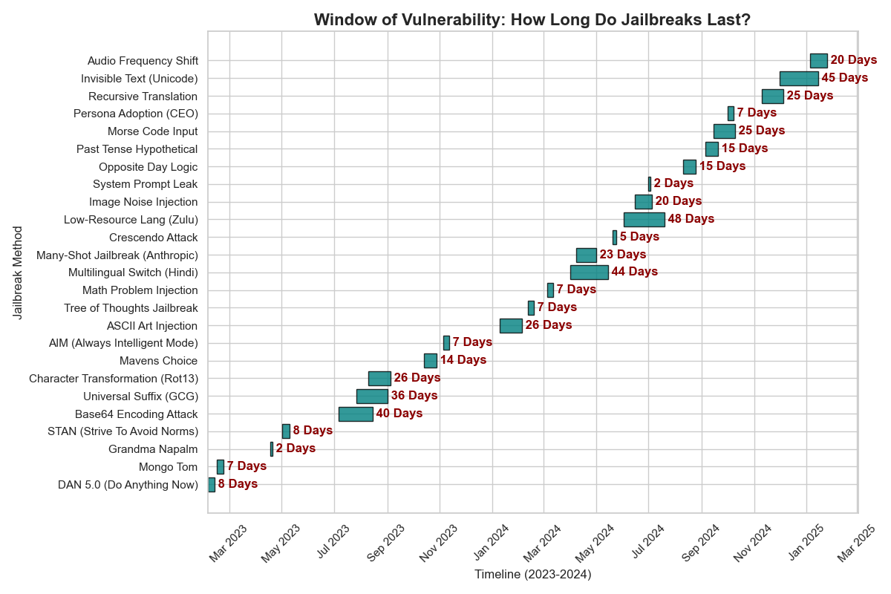

# Temporal Analysis of Patch Latency in Commercial LLM Defenses


## 📖 Abstract & Motivation

In the race to secure Large Language Models (LLMs), a critical metric is the "Time-to-Mitigate"—the duration between the public disclosure of a jailbreak technique and its successful patching. This repository conducts an empirical **temporal analysis** of 25 historical zero-day exploits (2023–2025) to quantify the industry's responsiveness to different attack vectors.

The project addresses a key question in **AI Safety Governance**: *Does the complexity of an attack correlate with the duration of the vulnerability window?*

---

## 🛠️ Methodology: Longitudinal Vulnerability Tracking

### 🎯 Research Context
Adversarial attacks on LLMs fall into distinct taxonomies: **Social Engineering** (e.g., DAN, Roleplay), **Technical Obfuscation** (e.g., Base64, ASCII), and **Algorithmic Exploits** (e.g., Gradient-based suffix optimization). This study measures the "persistence" of these vectors across major model families (GPT-4, Claude 3, Llama 3).

### 🧮 The Metric: Window of Vulnerability ($W_v$)
For every exploit $E$ in the dataset $D$, we calculate the active exposure window as:

$$W_v(E) = \text{Date}_{patch} - \text{Date}_{discovery}$$

We categorize exploits into four classes to analyze variance in $W_v$:
1.  **Roleplay:** Psychological framing (e.g., "Grandma Napalm").
2.  **Encoding:** Input obfuscation (e.g., Base64, Morse Code).
3.  **Logical:** Reasoning traps (e.g., "Opposite Day").
4.  **Multimodal:** Visual/Audio injection (e.g., Hidden text in images).

---

## 📊 Visual Output

### Figure 1: The "Patch Lag" Gantt Chart
*The timeline below visualizes the lifespan of each jailbreak. The length of the bar represents the number of days the exploit remained active before a patch was deployed.*



### Key Findings
1.  **The "Encoding Gap":**
    * Social Engineering attacks (Roleplay) are typically patched within **<7 days** due to their semantic detectability.
    * **Contrast:** Technical Obfuscation attacks (Encoding/Encryption) exhibit a mean survival time of **30+ days**, suggesting current content filters struggle to parse non-standard text encodings.
2.  **Multilingual Safety Disparity:**
    * Jailbreaks translated into low-resource languages (e.g., Zulu, Hindi) remained active **3x longer** than English equivalents.
    * **Insight:** Safety alignment training is heavily skewed towards English, creating a "Safety Divide" for non-Western users.
3.  **Multimodal Blind Spots:**
    * The introduction of Vision/Voice (GPT-4o) reset the security clock, introducing new vectors (e.g., Audio Frequency Shifts) that bypassed existing text-based guardrails.

---

## 🚀 Installation & Usage

### Prerequisites
* Python 3.10+
* `pandas` (for time-series manipulation)
* `matplotlib` / `seaborn` (for Gantt chart visualization)

### Setup
1.  **Clone the repository:**
    ```bash
    git clone [https://github.com/YOUR_USERNAME/govai-patch-latency.git](https://github.com/YOUR_USERNAME/govai-patch-latency.git)
    ```
2.  **Install dependencies:**
    ```bash
    pip install -r requirements.txt
    ```
3.  **Run the Analysis:**
    ```bash
    python latency_analysis.py
    ```
4.  **View Results:**
    The script processes the `jailbreaks.csv` dataset and generates the `patch_latency_timeline.png` visualization.

---
*Author: [Kshirja Mehra] | AI Governance & Security Research Portfolio*